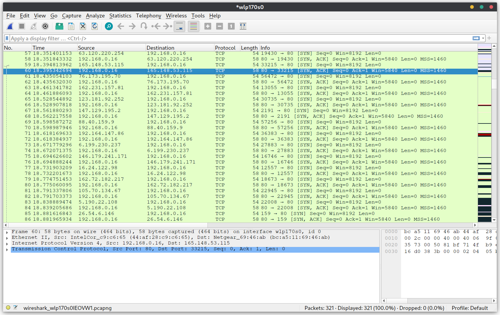
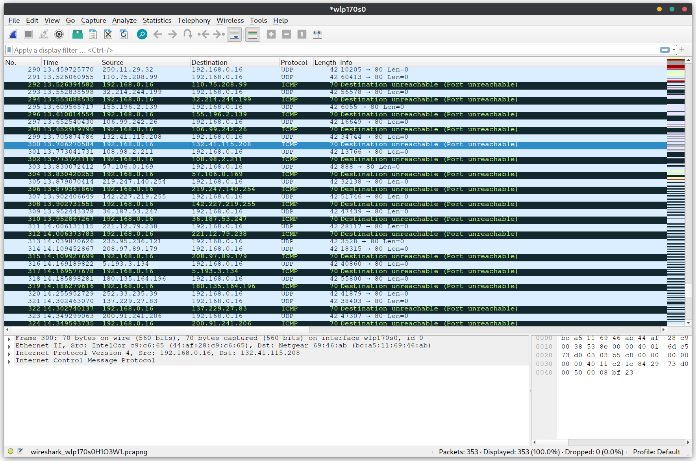
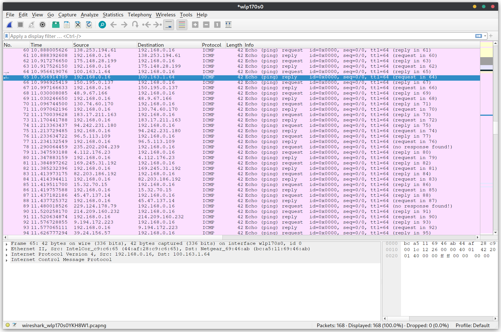

# TCP SYN Flooding Attacks
1. Explanation how the TCP SYN flood attack works.
    - TCP SYN flooding attacks take advantage of the TCP design that requires a 3 way handshake. By continually sending SYN packets, the server will keep sending back SYN ACK packets and waiting around to recieve an ACK. But the ACK will never come because either the sender isnt responding to them, or more likely, the sender has spoofed their IP anyways. This allows a single sender to spoof many different IP addresses, and make it look to the server as if there are many valid requests coming in. The server will use up all channels waiting for the ACKs and if it times out, another one will take its place. Thus the term *"flooding"* because all inputs are flooded with SYN packets.
2. Explanation how SYN cookies work to prevent denial-of-service effect from SYN flood attack.
    - SYN Cookies allow a TCP server not be flooded when TCP SYN flood attacks happen. Normally connections will be dropped when all available inputs are in use during a flood. SYN Cookies allow the server to essentially create the original SYN queue entry when an ACK is recieved because the SYN Cookie has helped encode the necessary information to do so.
3. Follow the lab document to launch TCP SYN flooding attacks by using Scapy.
    - See attached python code `syn_flood.py` or on github.
    - 

# UPD Flooding Attacks
1. Explanation how the UPD attack works.
    - UDP flooding is much more rudimentary and relies on the complete overwhelming of a networks resources similar to a simple PING DDoS attack. It floods the network with UDP datagram packets, and as seen below in the wireshark screenshot, the server sends back a "Destination Unreachable" packet. The attacker needs to have enough resources to completely overwhelm the other network.
2. Follow the lab document to launch UDP flooding attacks by using Scapy.
    - See attached python code `udp_flood.py` or on github.
    - 

# ICMP Flooding Attacks
1. Explanation how the ICMP attack works.
    - ICMP flood attacks are some of the first DDoS attacks that someone may learn. It relied on the *"ping"* protocol, and similar to the UDP flood attack, the attacker must have the network resources to completely overwhelm the other network. This is usually accomplished with botnets so that there can be a large expanse of computers all performing the attack at the same time. The attacker will repeatedly send an *"Echo (ping) request"* and the server will reply with an *"Echo (ping) response"*. This has to be done enough times at once to overload the server with too many messages, thus flooding its resources.
2. Follow the lab document to launch ICMP flooding attacks by using Scapy.
    - See attached python code `icmp_flood.py` or on github.
    - 
